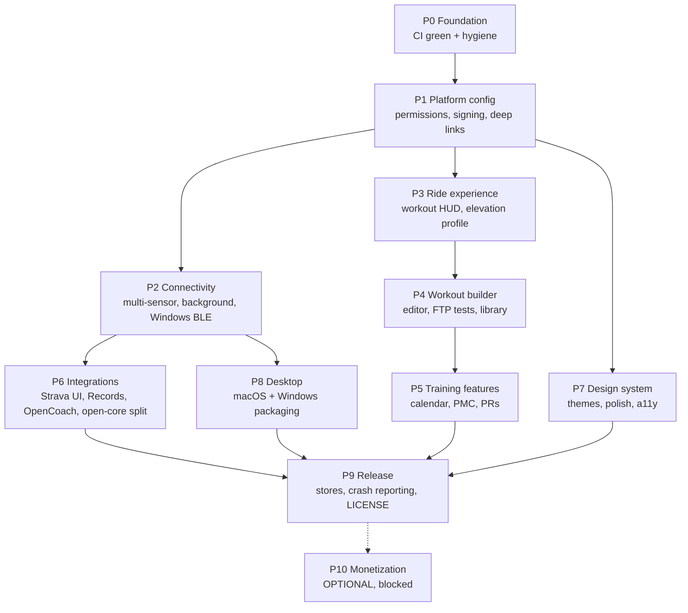

# OpenBike Shipping Roadmap

This directory is the executable plan that takes OpenBike from its current state to a
shippable app on **iOS, Android, Windows, and macOS** (Linux best-effort), with
best-in-class trainer + HRM connectivity, GPX route simulation, and feature parity with
subscription training apps (Wahoo SYSTM / Elite My E-Training class) — while staying
**open source** with an open-core split for the pieces that cannot be public
(OAuth credentials, Records and OpenCoach connections).

Each phase file in this directory is a self-contained work order for a coding agent.

---

## Current state (analysis snapshot, 2026-07)

### Production-quality — DO NOT REBUILD

| Component | Location |
|---|---|
| FTMS BLE stack: control handshake, ERG target power (0x05), SIM grade/wind/crr/cda (0x11), full Indoor Bike Data parser | `lib/infrastructure/ble/ftms/` |
| HR (0x180D, RR intervals), Cycling Power (0x1818, crank cadence), CSC (0x1816, wheel speed) readers + `SensorFusion` | `lib/infrastructure/ble/sensors/` |
| BLE transport: scan filtering, MTU negotiation, exponential-backoff auto-reconnect | `lib/infrastructure/ble/ble_transport.dart` |
| Physics engine (Martin et al. model, Newton-Raphson speed solver) | `lib/core/application/services/physics_engine.dart` |
| WorkoutEngine (ERG driver: ramps, intervals, repeats, pause/skip) | `lib/core/application/services/workout_engine.dart` |
| RouteSimulator (GPX → grade interpolation → SIM mode) | `lib/core/application/services/route_simulator.dart` |
| RecordingEngine (1 Hz sampling, laps, 30 s autosave) + ConnectionMonitor | `lib/core/application/services/` |
| Binary FIT encoder (definitions, CRC-16, session/lap/records) + TCX encoder | `lib/infrastructure/files/fit_encoder.dart`, `tcx_encoder.dart` |
| GPX / ZWO / ERG-MRC parsers | `lib/infrastructure/files/` |
| Strava OAuth2 plugin (auth-code flow, secure token storage, multipart upload, rate limiting) | `lib/plugins/exports/strava_export_plugin.dart` |
| Garmin local-FIT export plugin | `lib/plugins/exports/garmin_export_plugin.dart` |
| SQLite export queue: retry, exponential backoff, connectivity-resume | `lib/infrastructure/persistence/export_queue_service.dart` |
| ANT+ FE-C protocol (framing, channel init, pages 16/25/48–51) — blocked only on a concrete `UsbBackend` | `lib/infrastructure/ant/` |
| Physics-backed simulator device plugin (DEV_MODE) | `lib/infrastructure/simulator/` |
| Full UI shell wired to live providers: onboarding, home, ride (3 responsive layouts), device scan, workout library/detail, history, summary/detail, settings, dev tools | `lib/presentation/` |
| Drift schema v2 (7 tables), generated code committed, ~30 unit test files + 4 integration test files | `lib/infrastructure/persistence/`, `test/`, `integration_test/` |

### Gaps the phases below close

1. Android manifest has **zero permissions**; iOS Info.plist has **no Bluetooth usage strings / background modes** → BLE fails on real devices, store rejection.
2. Windows BLE not functional (flutter_blue_plus lacks Windows); ANT+ USB backend unimplemented. macOS BLE works already.
3. Only `FtmsDevicePlugin` is registered; `SensorDevicePlugin` never registered; no per-role pairing (trainer / HR / power / cadence).
4. Ride screen missing: workout HUD, elevation profile (`GpxProfileWidget` exists, unused), reconnect banner. No background recording.
5. Workout "builder" is import-only. No FTP test, calendar, or PMC (CTL/ATL/TSB).
6. Strava OAuth not wired to UI; `pedalhub://` scheme unregistered + branding leak; GPX export `UnimplementedError`.
7. Theme toggle dead (hard-dark app, hard-coded colors); legacy duplicate code; FIT encoder hard-codes FTP 200 W; destructive DB migrations.
8. No crash reporting, packaging, store assets, privacy policy, release pipeline, or LICENSE.

---

## Phase flow



Phases with no dependency edge between them (e.g. P2, P3, P7) can be executed in parallel
by separate agents on separate branches.

## Platform priority

1. **iOS + Android** — primary ship targets.
2. **Windows + macOS** — equal first-class desktop targets ("PC"). macOS BLE already works via flutter_blue_plus; Windows needs a backend swap (P2).
3. **Linux** — best-effort only; never a release blocker (its CI job is `continue-on-error`).

## Open-core strategy

OpenBike core is open source. The following stay out of the public repo and are loaded
via the existing plugin seams (`ExportPlugin` / `DevicePlugin` interfaces in
`lib/plugins/plugin_interfaces.dart`, registered in `main.dart`):

- **OAuth client credentials** (Strava, Garmin, future services) — injected at build time
  via `--dart-define` (already the mechanism in `main.dart`), sourced from CI secrets for
  release builds. Never committed.
- **Records and OpenCoach connections** — implemented as plugins in a **private companion
  package** (`openbike_private_plugins`, separate private repo) that release builds add as
  a dependency; the public app compiles and runs fully without it. P6 defines the seam.
- License choice (P9) must permit closed-source plugins to link against the core →
  MIT or Apache-2.0 for the core (not GPL).

---

## Execution protocol (for coding agents)

Every phase file starts with YAML frontmatter:

```yaml
---
phase: P2
title: Connectivity hardening
status: NOT_STARTED   # NOT_STARTED | IN_PROGRESS | BLOCKED | DONE
depends_on: [P1]
validation:
  - flutter analyze
  - flutter test
---
```

An agent picking up a phase MUST:

1. **Check dependencies** — every phase in `depends_on` has `status: DONE`. If not, stop
   and report BLOCKED.
2. **Claim it** — set `status: IN_PROGRESS` in the frontmatter (commit this).
3. **Execute tasks in order.** Each task is a checkbox with target file paths and
   acceptance criteria. Tick `[x]` as you complete each one, in the same commit as the
   code change.
4. **Validate** — run every command in `validation`; all must pass. Push and confirm the
   GitHub Actions `CI` workflow is green for the branch. Tasks whose acceptance criteria
   require physical hardware are marked `[HW]`: implement + unit-test them, then record
   them in the phase's "Pending hardware QA" section instead of blocking.
5. **Close it** — set `status: DONE` (or `BLOCKED` with a note if genuinely stuck) and
   update the checklist in this README.

### Standing rules

- Never rebuild the components in the "DO NOT REBUILD" table — extend them.
- Respect the hexagonal dependency rules in the repo `README.md` (domain depends on
  nothing; presentation depends on everything above it; infrastructure never imports
  presentation).
- Every behavior change ships with tests in the same commit (`test/` mirrors `lib/`).
- Generated code (`*.g.dart`, `*.freezed.dart`) is committed; re-run
  `dart run build_runner build --delete-conflicting-outputs` after changing annotated
  classes or the Drift schema.
- Commit messages: imperative mood, scoped to one phase, referencing the phase id
  (e.g. `P2: register SensorDevicePlugin and add pairing slots`).

## Status board

| Phase | Title | Status |
|---|---|---|
| [P0](P0-foundation.md) | Foundation — CI green, repo hygiene, correctness fixes | DONE |
| [P1](P1-platform-config.md) | Platform config — permissions, signing, deep links | DONE |
| [P2](P2-connectivity.md) | Connectivity — multi-sensor, background recording, Windows BLE | DONE |
| [P3](P3-ride-experience.md) | Ride experience — workout HUD, route profile | DONE |
| [P4](P4-workout-builder.md) | Workout builder, FTP tests, starter library | NOT_STARTED |
| [P5](P5-training-features.md) | Calendar, PMC, personal records | NOT_STARTED |
| [P6](P6-integrations.md) | Integrations — Strava UI, GPX export, Records, OpenCoach | NOT_STARTED |
| [P7](P7-design-system.md) | Design system — themes, polish, accessibility | NOT_STARTED |
| [P8](P8-desktop.md) | Desktop — macOS + Windows packaging, ANT+ stretch | NOT_STARTED |
| [P9](P9-release.md) | Release — stores, crash reporting, LICENSE | NOT_STARTED |
| [P10](P10-monetization-optional.md) | Monetization scaffolding (optional) | BLOCKED |
